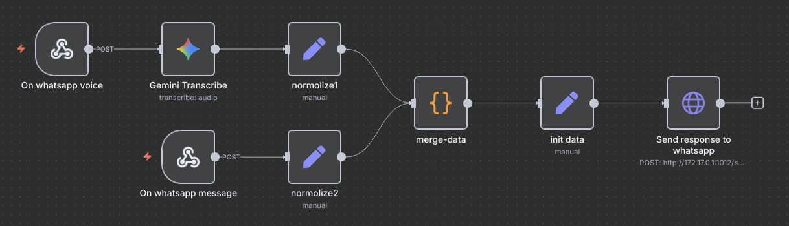

# Unofficial WhatsApp API for n8n

A lightweight unofficial WhatsApp API built with whatsmeow, designed to integrate WhatsApp with n8n.

It delivers incoming WhatsApp messages (text and voice notes) to n8n webhooks, and exposes a simple HTTP endpoint that n8n can call to send messages back.



## ✨ Features
- Receive WhatsApp messages → forward to webhook (text + voice notes).
- Send WhatsApp messages via POST /send.
- Basic Auth protection for webhooks and API.
- Persistent session with SQLite.
- QR code pairing for WhatsApp login.

## ⚙️ Requirements
- WhatsApp account (to scan QR code)
- n8n instance for automation

## 🚀 Setup
- Download Binary from Releases
- Create .env:

```
TEXT_WEBHOOK_URL=http://localhost:8080/webhook/whatsapp
VOICE_WEBHOOK_URL=http://localhost:8080/webhook/whatsapp/voice
WEBHOOK_USER=youruser
WEBHOOK_PASS=yourpass
LISTEN_ADDR=0.0.0.0:1012
```

- Run:

```
./whatsappapi-linux-amd64
```

NOTE: On first run, scan the displayed QR code in WhatsApp to pair the device.


## 📡 API

Send a Message
```
POST /send
Authorization: Basic base64(user:pass)
Content-Type: application/json

{
  "number": "1234567890",
  "text": "Hello from n8n!"
}
```

## 🔗 n8n Integration
- Configure Webhook nodes in n8n to capture messages from TEXT_WEBHOOK_URL and VOICE_WEBHOOK_URL.
- Use the /send endpoint to reply to WhatsApp messages programmatically.


## ⚠️ Notes
- This is unofficial and not affiliated with WhatsApp.
- Use responsibly to avoid account bans.
- For production: run behind reverse proxy + HTTPS.

